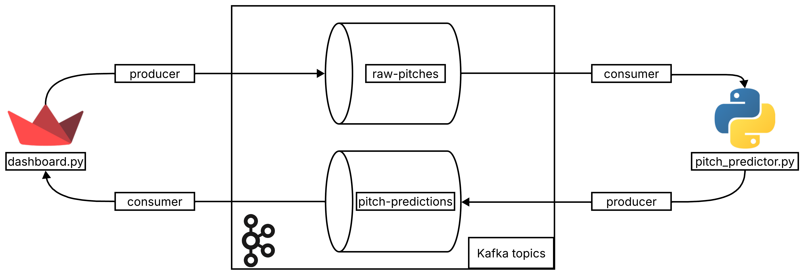

# ⚾ Real Time MLB Pitch Prediction Engine
## Overview
This project is a real-time baseball pitch prediction system powered by `machine learning` and `Apache Kafka`. It ingests pitch-by-pitch data from historical or live MLB games, streams it through a Kafka pipeline, applies a trained XGBoost model to predict the next pitch type, and visualizes everything in a Streamlit dashboard.


- Data Source: MLB `StatsAPI`
- Model: `XGBoost` Classifier predicting pitch types (Fastball, Slider, Curve, etc.)
- Streaming: `Kafka` based producer consumer loop
- Interface: Interactive `Streamlit` dashboard for selecting games, browsing pitches, and viewing predictions


## Table of Contents

- [Features](#features)
- [Project Structure](#project-structure)
- [How It Works](#how-it-works)
- [ML Model Overview](#ml-model-overview)
- [Installation & Setup](#installation--setup)
- [Training the Model](#training-the-model)
- [System Architecture](#system-architecture)
- [Future Improvements](#future-improvements)
- [Contributors](#contributors)


## Features
- Streamlit dashboard to explore live and historical MLB games
- Kafka-based real-time streaming of individual pitches
- Machine Learning model (XGBoost) to predict the next pitch type
- Smart preprocessing with one-hot encoding and game situation awareness
- Interactive UI to navigate pitch sequences and view predictions
- Modular pipeline using Python, joblib models, and Kafka consumers/producers


## Project Structure

```

├── apitester.py              # Extracts pitch-by-pitch data from MLB Stats API
├── benchmark_model.py        # Standalone test script to verify the model
├── dashboard.py              # Streamlit UI that interacts with Kafka
├── docker-compose.yml        # Docker setup for Kafka broker
├── pitch_predictor.py        # Kafka consumer + ML model prediction loop
├── model_features.joblib     # Saved feature names used by model
├── pitch_label_encoder.joblib # Label encoder for decoding predictions
├── xgb_pitch_model.joblib    # Trained XGBoost model
├── train-model.ipynb         # Jupyter notebook to train/test model
├── requirements.txt          # Python dependencies
```


## How It Works

1. **Pitch Data Extraction**  
   `apitester.py` grabs pitch-by-pitch sequences using the `statsapi`.

2. **Streamlit Dashboard**  
   `dashboard.py` lets users select a game, view pitch details, and simulate pitch-by-pitch progress. Each pitch is sent to Kafka (`raw-pitches` topic).

3. **Prediction Engine**  
   `pitch_predictor.py` consumes pitches from Kafka, preprocesses them, and uses the trained model to predict pitch type. The result is sent to the `pitch-predictions` topic.

4. **Live Feedback**  
   The dashboard listens for predictions and displays the most recent one alongside actual pitch results.


## ML Model Overview

- **Model**: XGBoost Classifier
- **Input Features**: 
  - Game situation (inning, outs, count)
  - Player info (batter/pitcher ID, hand preference)
  - Score differential
  - Base runner states
  - One-hot encoded categorical variables
- **Target**: `pitch_type` (e.g., FF, CH, SL, CU, etc.)
- **Multiclass Classification** with label-encoded pitch types


##  Installation & Setup

Prerequisites
- Python 3.8+
- Docker & Docker Compose


### 1. Install Dependencies

```
pip install -r requirements.txt
```

### 2. Start Kafka with Docker

```
docker-compose up -d
```

Make sure Kafka is listening on `localhost:9092`.

### 3. Create Kafka Topics
Once the containers are running, open a shell inside the Kafka container:

```
docker exec -it kafka bash
```
Navigate to Kafka's binary directory

```
cd /opt/kafka_2.13-2.8.1/bin
```

Create the Kafka topics
```

# Topic for raw pitch data
kafka-topics.sh --create --zookeeper zookeeper:2181 --replication-factor 1 --partitions 1 --topic raw-pitches

# Topic for ML model predictions
kafka-topics.sh --create --zookeeper zookeeper:2181 --replication-factor 1 --partitions 1 --topic pitch-predictions
```
Verify the topics were created
```
kafka-topics.sh --list --zookeeper zookeeper:2181
```
Exit the container
```
exit
```
### 4. Start the Prediction Engine

```
python pitch_predictor.py
```

### 5. Launch the Dashboard

```
streamlit run dashboard.py
```


## Training the Model

To train or retrain the model, use:

```
jupyter notebook train-model.ipynb
```

It includes feature engineering, XGBoost training, model evaluation, and joblib export.


## System Architecture



## Future Improvements

- Improve model accuracy by including pitch velocity and location
- Add pitcher/batter history features
- Deploy to cloud and enable remote Kafka setup


## Contributors

Malachi Rosario